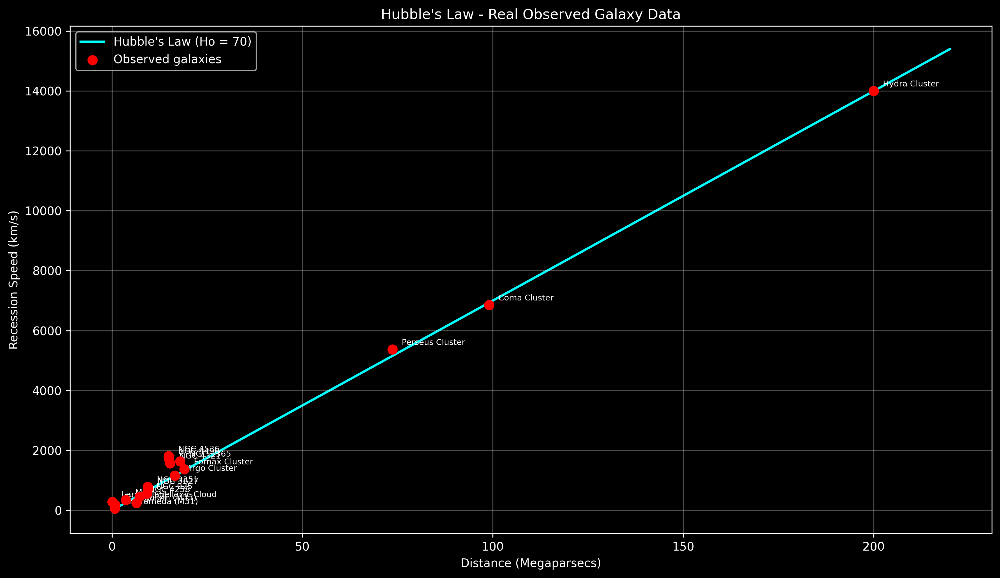

# Galaxy Recession Calculator

A Python tool that demonstrates Hubble's Law — the relationship between a galaxy's distance and its recession speed — through an interactive calculator, a theoretical visualizer, and real observational data from published astronomical surveys.

## The Physics

Hubble's Law states that galaxies are receding from us at speeds proportional to their distance:

**v = H₀ × d**

Where:
- `v` = recession speed (km/s)
- `H₀` = Hubble's constant (~70 km/s per Megaparsec)
- `d` = distance in Megaparsecs (1 Mpc ≈ 3.26 million light-years)

This relationship is direct evidence that the universe is expanding.

## Project Structure

### Stage 1 — `calculator.py`
Interactive command-line calculator. Enter any galaxy distance in Megaparsecs and get its recession speed instantly.

### Stage 2 — `visualizer.py`
Plots a theoretical Hubble diagram using NumPy vectorization and Matplotlib. Includes labeled data points for real named galaxies including Andromeda, the Virgo Cluster, the Coma Cluster, and the Hydra Cluster.

### Stage 3 — `data_fetcher.py`
Plots a Hubble diagram using real observational data sourced from the HST Key Project (Freedman et al. 2001) — the landmark study that pinned down Hubble's constant. Points intentionally scatter around the theoretical line due to peculiar velocities and measurement uncertainty, which is physically accurate.

## Example Output



## Installation

```bash
pip install matplotlib numpy astropy astroquery
```

## How to Run

```bash
# Stage 1 - Calculator
python calculator.py

# Stage 2 - Theoretical visualizer
python visualizer.py

# Stage 3 - Real data plot
python data_fetcher.py
```

## Technologies
- Python 3.13
- NumPy — vectorized array operations
- Matplotlib — scientific visualization
- Astropy — astronomical units and data handling
- Data: HST Key Project (Freedman et al. 2001), NED/IPAC